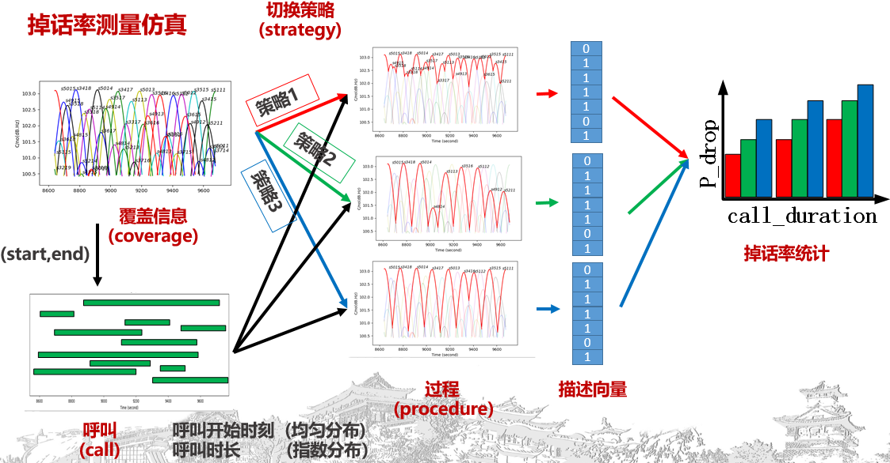
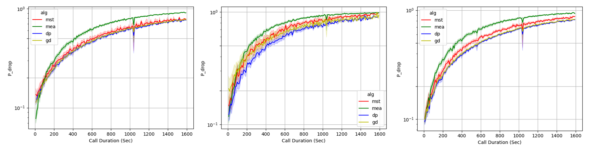

# TSH
Terminal-Satellite Handover


### 1.场景创建


这里有两个access, 一个是链路预算需要的(参考[链路预算视频](https://www.bilibili.com/video/BV1Ru41127zM/)
), 即`place::motor::receiver --> satellite`;
另一个是吻合星地链路的视线范围(Line of Sight)的access, 即 `place::motor --> satellite`.

这样就会达到目的


### 2. 数据导出

需要先通过stk生成access数据, 此处有一个较小的例子, 单颗卫星对地面站的access. 这里首先创建场景, 如下


``` python
# chengdu 		 	#place
# 	motor1		 	#sensor
#		reciver1 	#reciver


#sat				#satellite
#	motor2		 	#sensor
#		transmitter	#transmitter

```
文章中称为 coverage intervals table.

### 3.数据预处理

预处理后, 信息量不变,  得到处理后的数据`*.csv`格式

### 4. 施加算法`main.py`
`config file: config.yaml`

根据设置, 随机生成子场景的时刻和持续时间, 载入内存, 将这部分数据, 施加算法, 得到一个procedure.
`sim_duration -> random_seed -> algorithm ==> procedure`

### 5. 批量处理 `batch_run.py`

`config file: city_sim_duration.yaml`

根据随机种子列表, 对`step.4`反复, 得到一个instance, 保存到文件夹.
``` python
for seed in seeds:
    for alg in algorithm
        do
```
### 6. 终端再批量

对 step.5 的脚本, 运行多次, 得到不同的instance
`city -> sim_duration -> random_seed -> algorithm ==> procedure`

### 7. measurement
连接性测量, QoS测量


- 掉话率测量伪代码, 输入为一个instance(city-sim_duration dir)
```python

    for batch_calls, batch_procedures in zip([calls_container, procedures_container]):
        for procedure in batch_procedures:
            procedure.inject(batch_calls)
```

掉话率测量过程如图所示



掉话率测量结果如下


