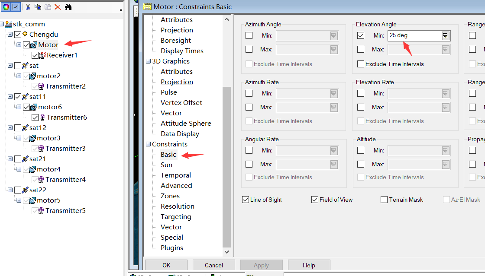
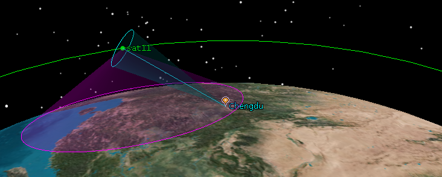

# TSLa
Terminal-Satellite Link assignment(Satellite Handover)


# STK access

### 1.场景创建
需要先通过stk生成access数据, 此处有一个较小的例子, 单颗卫星对地面站的access. 这里首先创建场景, 如下


``` python
# chengdu 		 	#place
# 	motor1		 	#sensor
#		reciver1 	#reciver


#sat				#satellite
#	motor2		 	#sensor
#		transmitter	#transmitter

```


### 2.access

这里有两个access, 一个是链路预算需要的(参考[链路预算视频](https://www.bilibili.com/video/BV1Ru41127zM/)
), 即`place::motor::receiver --> satellite`;
另一个是吻合星地链路的视线范围(Line of Sight)的access, 即 `place::motor --> satellite`.

这样就会达到目的




